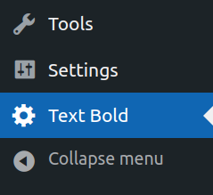
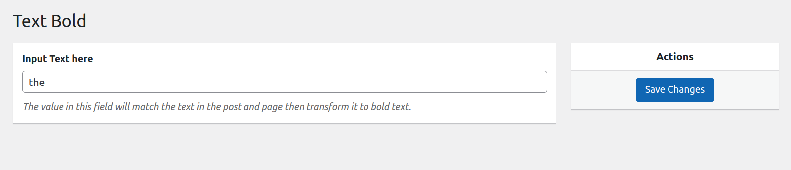
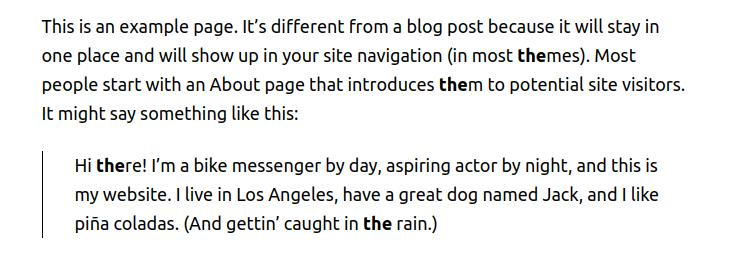

# Text Bold Plugin

### Installation

- Go to your wordpress site and login to the **admin dashboard**.
- In the left panel menu, click "**Plugins**".
- Locate the "**Add New**" button(It's beside the title) and click it.
- You will see an "**Upload Plugin**" button and just click on that button one more time. This will show you a form that will let you upload the plugin.
- Click "**Choose File**" and select the **text-bold-plugin zip** file.
- Click **Install** and **Activate**.
- **Congrats**! You have installed "**Text Bold Plugin**" in your website.

### How to use the plugin
- The "Text Bold" settings can be located under the admin sidebar menu panel.\
 
- Whatever text you save in the field will match all the substring of the contents of your site posts or pages and then transform it to a bold text.\

- Go to  one of your pages and see the result. It should look something like this.\

- **And that's it! Enjoy!**
